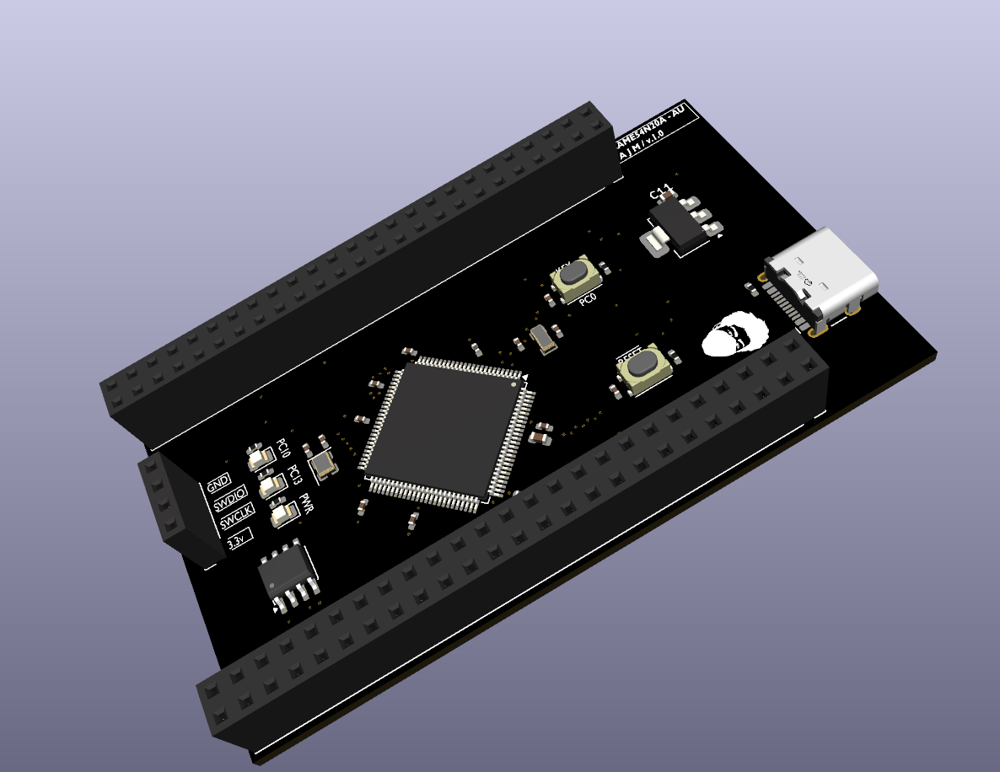

# ATSAME54N20A-AU Development Board

**A custom-designed development board built around the Microchip ATSAME54N20A-AU (ARM Cortex-M4F)**

Designed end-to-end in KiCad — schematic, routing, and silkscreen.

---

## Overview

This is a fully custom development board designed from a bare microcontroller datasheet up — power architecture, signal routing, and silkscreen branding all done by hand in KiCad, not adapted from a reference design.

## Features

| Feature | Detail |
|---|---|
| **MCU** | Microchip ATSAME54N20A-AU — ARM Cortex-M4F, 120MHz, 1MB flash, 100-pin TQFP |
| **USB** | USB Type-C connector (power + native USB) |
| **CAN** | Onboard CAN controller/transceiver for real bus communication |
| **Storage** | microSD card slot (SDHC) + external QSPI flash |
| **Debug** | SWD programming/debug header |
| **Indicators** | 1x power LED, 2x user-controllable LEDs |
| **I/O** | Dual 2-row GPIO headers (one on each side) — breadboard-compatible pitch |

## Board layout

- **Left and right edges:** two rows of breakout headers on each side, broken out to standard 2.54mm pitch for direct breadboard use
- **Top section:** power, USB-C, SD card slot, SWD header
- **Center:** ATSAME54N20A-AU (TQFP-100)

## Getting started

1. Clone this repository
2. Open `ATSAME54N20A-AU.kicad_pro` in **KiCad 10** or later
3. Manufacturing-ready files are already generated under `gerber_to_order/` if you just want to order the board as-is

## Programming

Program and debug via the onboard **SWD header** using any ARM-compatible probe (ST-Link, J-Link, Atmel-ICE, or similar), through OpenOCD/GDB or MPLAB X.

## Bill of Materials

Full BOM with reference designators, values, and footprints is in `production/bom.csv`.

## Revision history

See [CHANGELOG.md](CHANGELOG.md) for what changed between board revisions.

## License

Licensed under [CERN-OHL-S v2](LICENSE).

## Status

🔧 **Active development** — first hardware revision fabricated, pending assembly and bring-up testing.

---

Built with KiCad · Designed by Albin Jose Mathew

